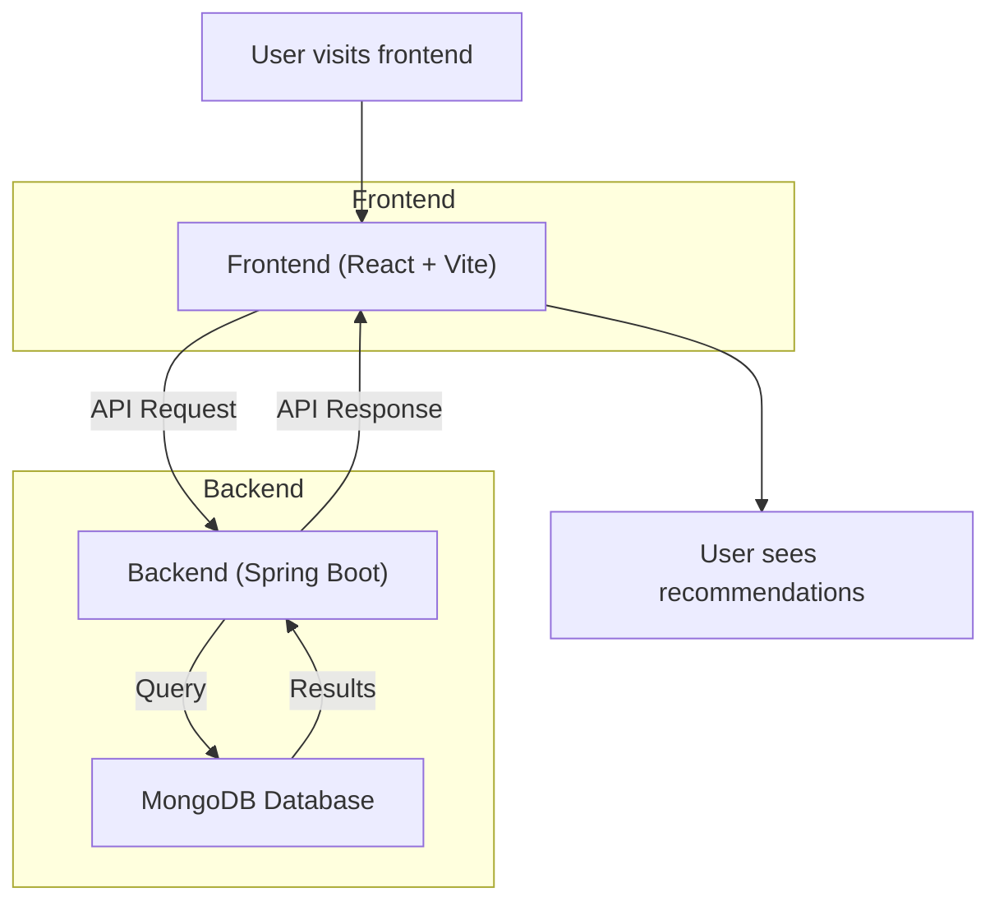
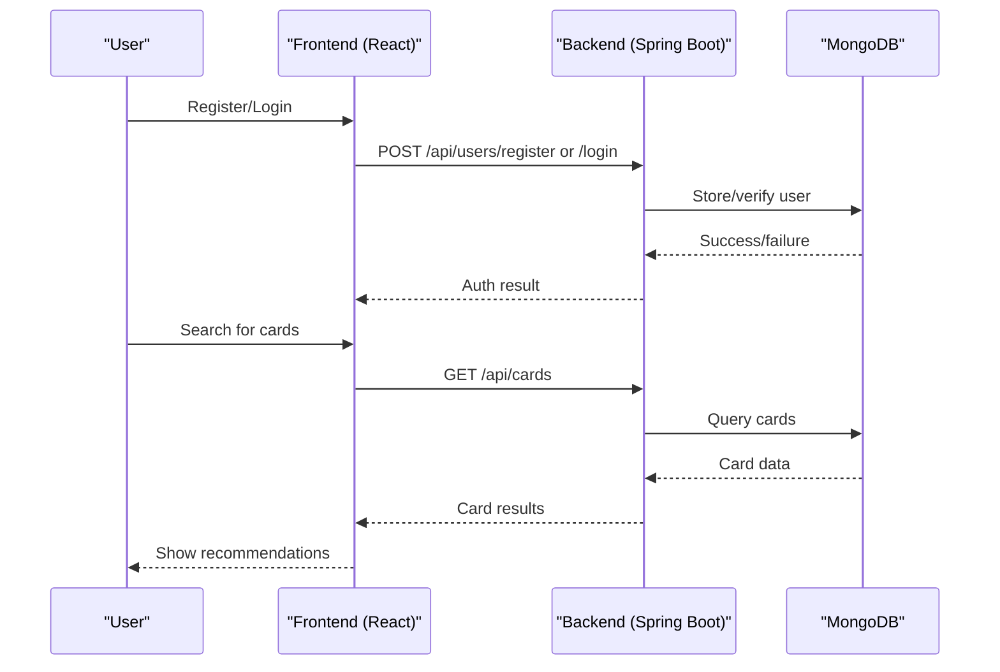

<p align="center">
  
</p>

<h1 align="center">Credit Card Recommender</h1>

<p align="center">
  <b>Find the best credit card for you, instantly.</b><br/>
  <a href="#workflow">Workflow</a> • <a href="#features">Features</a> • <a href="#tech-stack">Tech Stack</a> • <a href="#getting-started">Getting Started</a>
</p>

<p align="center">
  
  
  
  
  
</p>

---

## 🚀 Project Overview
Credit Card Recommender is a full-stack web app that helps users discover the best credit cards based on their income and credit score. It features secure authentication, a modern UI, and real-time recommendations.

---

## 🛠️ Tech Stack
- **Frontend:** React, TypeScript, Vite, CSS Modules
- **Backend:** Spring Boot, Java 17, MongoDB
- **Security:** BCrypt password hashing, CORS

---

## 🔄 Workflow

### System Architecture



### User Journey



---

## ✨ Features
- User registration & login (secure, hashed passwords)
- Personalized credit card recommendations
- Filter by income, credit score, and preferences
- Responsive dashboard UI
- Modern, maintainable codebase

---

## 📁 Project Structure
```
Hackathon/
  backend/    # Spring Boot backend (API, DB, auth)
  frontend/   # React + TypeScript + Vite frontend (UI)
```

---

## ⚡ Getting Started

### Backend
See [backend/README.md](backend/README.md) for full details.
```bash
cd backend
./mvnw spring-boot:run
```

### Frontend
See [frontend/README.md](frontend/README.md) for full details.
```bash
cd frontend
npm install
npm run dev
```

---

## 🤝 Contributing
Pull requests are welcome! For major changes, please open an issue first to discuss what you would like to change.

---

## 📄 License
[MIT](LICENSE)
