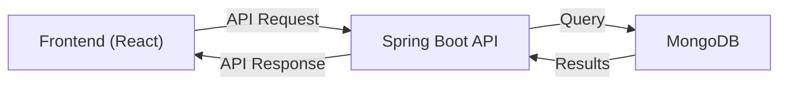

<h1 align="center">Backend – Credit Card Recommender</h1>

<p align="center">
  
  
  
</p>

---

## 🏗️ Overview
This backend powers the Credit Card Recommender app, providing secure authentication, user management, and credit card data APIs. Built with Spring Boot and MongoDB.

---

## 📦 Structure
```
backend/
  src/main/java/com/example/backend/
    controller/   # REST endpoints
    model/        # Data models
    repository/   # MongoDB repositories
    config/       # Security config
    HelloController.java
    BackendApplication.java
  src/main/resources/
    application.properties
    creditCardData.json
```

---

## 🔄 Workflow



---

## 🔐 Security
- Passwords are hashed with BCrypt
- CORS enabled for frontend dev (`http://localhost:5173`)
- Sensitive endpoints require validation

---

## 🚦 API Endpoints

| Endpoint                  | Method | Description                  |
|--------------------------|--------|------------------------------|
| `/api/users/register`     | POST   | Register a new user          |
| `/api/users/login`        | POST   | Login with email/password    |
| `/api/cards`              | GET    | Get all credit cards         |
| `/api/cards`              | POST   | Add a new credit card        |
| `/api/message`            | GET    | Test endpoint (greeting)     |

---

## 🧩 Key Components
- **UserController**: Handles registration & login
- **CreditCardController**: Manages card data
- **HelloController**: Test endpoint
- **SecurityConfig**: CORS, password encoding

---

## ⚡ Quickstart
```bash
cd backend
./mvnw spring-boot:run
```

---

## 🛠️ Modifying the Backend
- Add models in `model/` (annotate with `@Document`)
- Add endpoints in `controller/`
- Add repositories in `repository/` (extend `MongoRepository`)
- Update security in `config/SecurityConfig.java`

---

## 📄 License
[MIT](../LICENSE)
