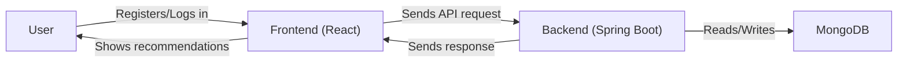

<h1 align="center">Frontend – Credit Card Recommender</h1>

<p align="center">
  
</p>

<p align="center">
  
  
  
  
</p>

---

## 🌟 Overview
This is the frontend for the Credit Card Recommender app. It provides a modern, responsive UI for users to register, log in, and receive personalized credit card recommendations.

---

## 🖼️ UI Preview
> _Add your own screenshots here!_

<p align="center">
  
  
</p>

---

## 📦 Structure
```
frontend/
  src/
    components/
      auth/           # LoginForm, SignupForm
      CreditCardWidget.tsx
    pages/            # Dashboard, LoginPage, SignupPage
    styles/           # CSS modules
    assets/
  public/
    vite.svg          # Logo
  index.html
```

---

## 🔄 Workflow



---

## ✨ Main Components & Pages
- **LoginPage / SignupPage**: Entry points for authentication
- **Dashboard**: Search/filter credit cards by income, credit score, preferences
- **CreditCardWidget**: Visual card display
- **LoginForm / SignupForm**: Handles user authentication

---

## ⚡ Quickstart
```bash
cd frontend
npm install
npm run dev
```
App runs at [http://localhost:5173](http://localhost:5173)

---

## 🔗 API Integration
- Communicates with backend at `http://localhost:8080`
- Endpoints:
  - `POST /api/users/login` — User login
  - `POST /api/users/register` — User registration
  - `GET /api/cards` — Fetch credit card data

---

## 🛠️ Development Tips
- Update API URLs if backend runs on a different port
- Use React DevTools for debugging
- Build for production: `npm run build`

---

## 📄 License
[MIT](../LICENSE)
